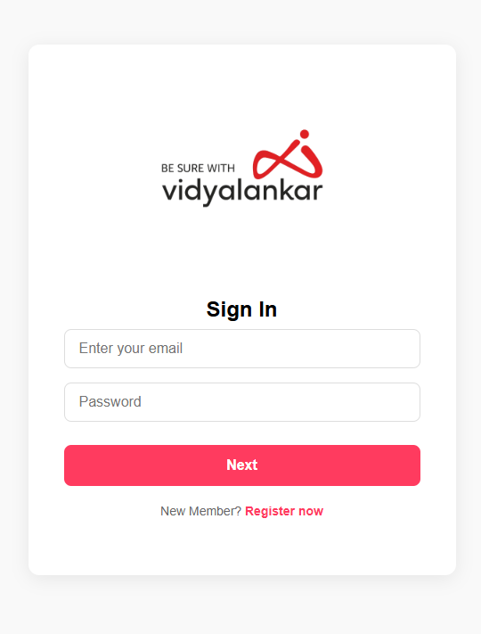
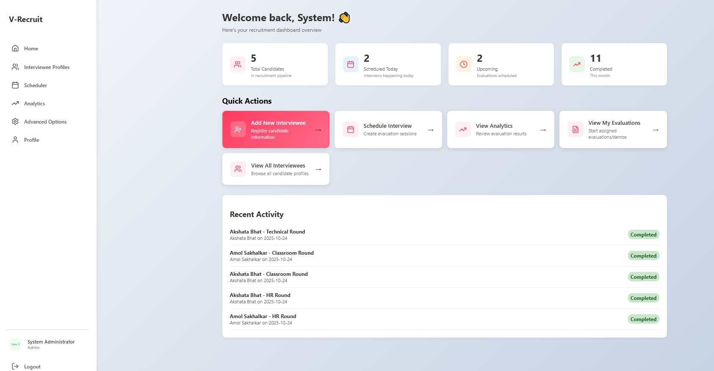
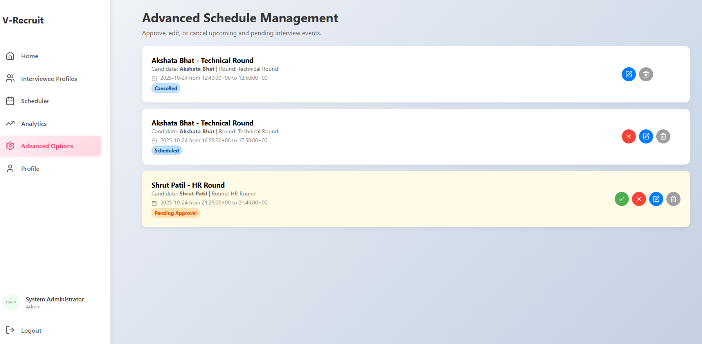
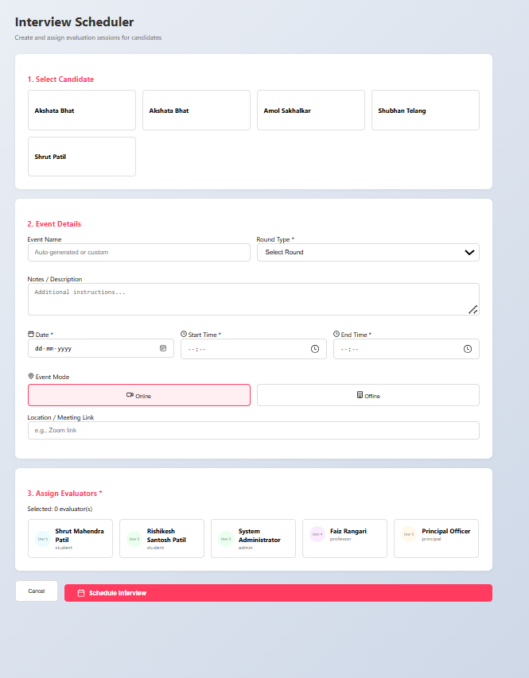
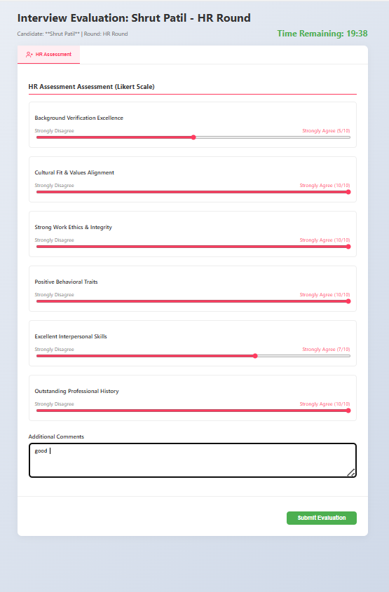
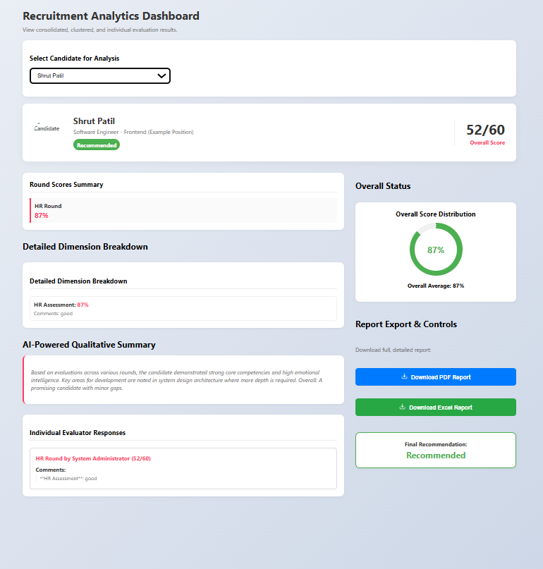
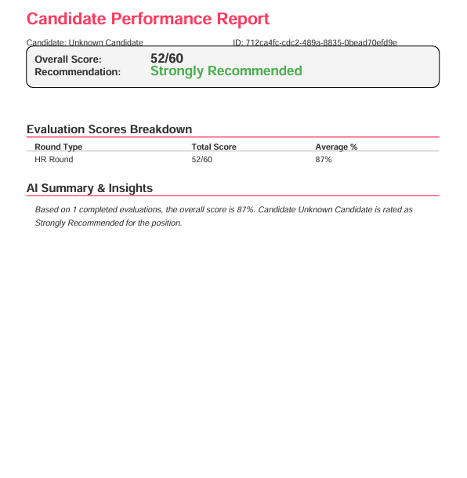

# V-Recruitment Interview Evaluation App


## Description

The V-Recruitment Interview Evaluation App project provides a foundation for building robust recruitment applications. Leveraging database technologies for efficient data storage, comprehensive testing to ensure reliability, and web technologies for accessibility, v-recruitment offers a versatile platform for managing the hiring process.

## Features

- Database
- Testing
- Web


## Project Structure

```
v-recruitment
├── backend
│   ├── app.py
│   └── requirements.txt
├── check_metrics.py
└── frontend
    ├── eslint.config.js
    ├── index.html
    ├── package.json
    ├── public
    │   ├── _redirects
    │   └── vite.svg
    ├── src
    │   ├── App.jsx
    │   ├── assets
    │   │   ├── App_logo.png
    │   │   ├── Dashboard.css
    │   │   ├── IntervieweeForm.css
    │   │   └── signup_logo.png
    │   ├── components
    │   │   ├── AdminDashboard.jsx
    │   │   ├── EvaluationForm.jsx
    │   │   ├── Sidebar.jsx
    │   │   └── StudentDashboard.jsx
    │   ├── index.css
    │   ├── main.jsx
    │   ├── pages
    │   │   ├── AdminPage.jsx
    │   │   ├── AdvancedAdminPage.jsx
    │   │   ├── AnalyticsDashboardPage.jsx
    │   │   ├── Auth.module.css
    │   │   ├── CompleteProfilePage.jsx
    │   │   ├── EvaluationDisclaimerPage.jsx
    │   │   ├── EvaluationListPage.jsx
    │   │   ├── FacultyPage.jsx
    │   │   ├── HomePage.jsx
    │   │   ├── IntervieweeListPage.jsx
    │   │   ├── LoginPage.jsx
    │   │   ├── PastFeedbackPage.jsx
    │   │   ├── PrincipalPage.jsx
    │   │   ├── SchedulerPage.jsx
    │   │   ├── SignupPage.jsx
    │   │   └── StudentPage.jsx
    │   └── supabase.js
    └── vite.config.js
```
# UI/UX 
<p align="center">
  
  
  
</p>

<p align="center">
  
  
</p>

<p align="center">
  
  
</p>


# Recruitment Evaluation System

This document outlines the system architecture, technology stack, core features, and deployment procedures for the Recruitment Evaluation Platform.

## Table of Contents

1.  [System Architecture](#system-architecture)
2.  [Technology Stack](#technology-stack)
3.  [Core Features](#core-features)
4.  [Data Structures and Schema](#data-structures-and-schema)
5.  [Security Implementation](#security-implementation)
6.  [API Endpoints](#api-endpoints)
7.  [Installation and Deployment](#installation-and-deployment)
8.  [Known Limitations and Troubleshooting](#known-limitations-and-troubleshooting)
9.  [Future Enhancements](#future-enhancements)

-----

## 1\. System Architecture

The platform follows a standard three-tier architecture: **Frontend** (React/Vite), **Backend** (Flask REST API), and **Data Layer** (Supabase/PostgreSQL). The backend acts as the single source of truth, integrating with Supabase for data and authentication, ReportLab for PDF generation, and Google GenAI for qualitative summaries.

-----

## 2\. Technology Stack

### Frontend

  * **Framework:** React 19.2.0 with React Router DOM for navigation
  * **Build Tool:** Vite 7.1.10
  * **Iconography:** Lucide React
  * **Styling:** Custom CSS modules

### Backend

  * **Framework:** Flask (Python) REST API
  * **Reporting:** ReportLab for PDF generation
  * **AI Integration:** Google GenAI for AI-powered summaries

### Database and Authentication

  * **Database:** Supabase (PostgreSQL) for data persistence
  * **Authentication:** Supabase Auth for user authentication and authorization
  * **Security:** Row Level Security (RLS) policies for fine-grained data access control

### Storage

  * **File Management:** Supabase Storage for resume file management (`resumes` bucket)

-----

## 3\. Core Features

### Multi-Role System

The platform enforces hierarchical permissions via four distinct user roles:

| Role | Permissions |
| :--- | :--- |
| **Administrator** | Complete system access, candidate creation, interview scheduling and approval, analytics dashboard access, advanced schedule management. |
| **Principal** | Evaluation assignment access, analytics dashboard viewing, final verdict submission authority. |
| **Faculty (Professor)** | Multi-round evaluation participation, past feedback review. |
| **Student** | Classroom round evaluation only, past feedback review. |

[Download the Full Recruitment Flowchart](frontend/src/assets/V-RECRUITMENT_FLOWCHART.pdf)
-----

### Candidate Management

  * **Profile Registration:** Capture comprehensive personal, academic (X, XII, Graduation, Post-Graduation), professional, computer skills, and language proficiency data.
  * **Self-Rating:** Competency self-evaluation.
  * **Resume Upload:** File upload with a **5MB limit**.
  * **Additional Info:** Family details and other supplementary information.

-----

### Evaluation System

#### Round Types

  * **Classroom Round:** Teaching demonstration assessment.
  * **HR Round:** Cultural fit and behavioral evaluation.
  * **Technical Round:** Domain expertise verification.
  * **Final Round:** Comprehensive review and verdict submission.

#### Assessment Modules

Evaluations cover five core dimensions:

1.  **Appearance:** Attire, grooming, posture, presentation.
2.  **Communication:** Verbal skills, listening, non-verbal cues, coherence.
3.  **Psychometric:** Problem-solving, adaptability, teamwork, leadership, stress management.
4.  **HR Assessment:** Background verification, cultural fit, work ethic.
5.  **Technical:** Core skills, problem-solving, code quality, system design.

#### Scoring Mechanism

  * **Quantitative:** Likert scale (0-10).
  * **Qualitative:** Comment boxes for detailed feedback.
  * **Time Enforcement:** Real-time timer; auto-submission on timeout.
  * **Immutability:** Evaluations are immutable post-submission.

-----

### Scheduling System

#### Workflow

1.  Admin creates a schedule, assigning a candidate and evaluators.
2.  Event enters **"Pending Approval"** state (12-hour window).
3.  Admin approves or cancels the event within the window.
4.  Approved events transition to **"Scheduled"**.
5.  Evaluators gain access 15 minutes before the start time.
6.  Post-evaluation, status updates to **"Completed"**.

-----

### Analytics Dashboard

#### Data Aggregation

  * Round-wise score clustering.
  * Overall performance metrics calculation.
  * Dimension-wise breakdown.
  * Individual evaluator response tracking.

#### Report Generation

  * PDF and CSV export capabilities.
  * Detailed dimension analysis.
  * **AI-generated qualitative summaries** (Google GenAI integration).
  * Final recommendation visualization.

#### Recommendation Logic

  * **\> 80%:** Recommended
  * **60–80%:** Waitlist
  * **\< 60%:** Not Recommended

-----

### Real-Time Features

  * **Timer Management:** Server-synchronized countdown with visual indicators (green $>60$s, red $\le 60$s). No pause/resume functionality. Automatic form submission on expiry.
  * **Progress Tracking:** Interview stage visualization, completion status indicators, and real-time schedule updates.

-----

## 4\. Data Structures and Schema

### Candidate Data Structure

```json
{
  "personal_details": {},
  "academic_details": [],
  "experience_details": [],
  "computer_skills": { "ms_office", "tally", "custom_skills" },
  "languages_known": { "english", "marathi", "hindi", "other" },
  "self_ratings": {},
  "reporting_officers": [],
  "resume_url": "supabase_storage_url"
}
```

### Schedule Configuration

```json
{
  "candidate_id": "uuid",
  "evaluator_uids": ["uuid1", "uuid2"],
  "round_type": "Technical Round",
  "date": "YYYY-MM-DD",
  "start_time": "HH:MM:SS",
  "end_time": "HH:MM:SS",
  "duration_minutes": "calculated",
  "mode": "Online|Offline",
  "location": "meeting_link_or_room",
  "status": "Pending Approval|Scheduled|Completed|Cancelled"
}
```

### Database Schema (Core Tables)

| Table | Primary Key | Foreign Key | Key Fields |
| :--- | :--- | :--- | :--- |
| **users** | `uid` (uuid) | - | `email` (unique), `full_name`, `role` (admin | principal | professor | student | candidate), `profile_complete`, `profile_image_url` |
| **candidate\_profiles** | `id` (serial) | `user_id` $\to$ users.uid | `position_applied_for`, `academic_details` (jsonb), `experience_details` (jsonb), `resume_url`, `final_verdict` |
| **schedules** | `id` (uuid) | `candidate_id` $\to$ users.uid | `evaluator_uids` (uuid[]), `round_type`, `status`, `date`, `start_time`, `duration_minutes` |
| **evaluations** | `id` (uuid) | `schedule_id` $\to$ schedules.id, `evaluator_uid` $\to$ users.uid, `candidate_uid` $\to$ users.uid | `quantitative_scores` (jsonb), `qualitative_comments` (jsonb), `total_score`, `total_max_score`, `is_complete` |

-----

## 5\. Security Implementation

### Row Level Security (RLS) Policies

| Table | Policy | Access |
| :--- | :--- | :--- |
| **users** | Authenticated users | Read own profile |
| | Service role | Full CRUD |
| **candidate\_profiles** | Admin | Full CRUD |
| | Authenticated | Read access for evaluation purposes |
| **schedules** | Authenticated users | Read assigned schedules |
| | Admin | Full CRUD |
| **evaluations** | Evaluators | Create and read own evaluations |
| | Admin/Principal | Read all evaluations |

### Authentication Flow

1.  User registration uses **Supabase Auth**.
2.  A database trigger creates the corresponding `users` table entry.
3.  Role assignment (Admin, Principal, etc.) dictates access permissions.
4.  **Profile completion** is required before dashboard access.
5.  Session management is handled by **JWT tokens**.

-----

## 6\. API Endpoints

| Method | Endpoint | Description |
| :--- | :--- | :--- |
| `POST` | `/api/candidate/add` | Creates a candidate profile and uploads the resume to Supabase Storage. Returns candidate UID. |
| `GET` | `/api/report?candidate_id={uuid}` | Aggregates evaluation data and generates a formatted **PDF report**. |
| `GET` | `/api/report/excel?candidate_id={uuid}` | Exports evaluation data as **CSV** (including scores and comments). |
| `POST` | `/api/summarize` | Accepts an array of qualitative comments and returns an **AI-generated summary** text. |
| `GET` | `/api/test` | Health check endpoint. |

-----

## 7\. Installation and Deployment

### Prerequisites

  * Node.js `>= 20.19.0`
  * Python `>= 3.8`
  * Supabase Project (URL and Service Role Key)
  * SMTP Server (for potential email notifications)

### Backend Setup (Flask/Python)

```bash
cd backend
python -m venv venv
source venv/bin/activate  # Windows: venv\Scripts\activate
pip install -r requirements.txt
python app.py
```

### Frontend Setup (React/Vite)

```bash
cd frontend
npm install
npm run dev
```

### Production Deployment

#### Frontend (Netlify Example)

1.  Connect repository to Netlify.
2.  Build command: `npm run build`
3.  Publish directory: `dist`
4.  Set environment variables in the Netlify dashboard.

#### Backend (Heroku/Railway/Render Example)

1.  Configure the Python buildpack.
2.  Set environment variables (`SUPABASE_URL`, etc.).
3.  Deploy from the Git repository.
4.  **Update the frontend API URL** to the production backend endpoint.

#### Database Setup

1.  Create a Supabase project.
2.  Execute schema creation scripts for all core tables.
3.  Configure all necessary RLS policies.
4.  Create a storage bucket named **`resumes`** and set it for public read access.

-----

## 8\. Known Limitations and Troubleshooting

### Known Limitations

  * **Resume Storage:** Direct file upload only; no integration with external document services.
  * **Browser Compatibility:** Chrome/Edge recommended.
  * **Evaluation Immutability:** No edit functionality post-submission.
  * **Concurrent Evaluations:** Not restricted; no locking mechanism for simultaneous evaluation submissions.
  * **Offline Mode:** Not supported.

### Troubleshooting Guide

| Issue | Solution |
| :--- | :--- |
| `"SUPABASE_URL or SUPABASE_SERVICE_ROLE_KEY is missing"` | Verify `backend/.env` file exists with correct values. |
| Schedule data fails to load on Evaluation page | Check RLS policies on the `schedules` table for the user's role. |
| Resume upload fails | Verify the storage bucket named **`resumes`** exists with proper permissions (public read access). |
| Evaluation form shows `"Time Expired"` immediately | Verify `schedule.start_time` and `schedule.duration_minutes` are correctly configured. |
| Analytics dashboard shows `"No completed evaluations found"` | Ensure the `evaluations` table has records where `is_complete = true`. |

-----

## 9\. Future Enhancements

  * Email notification system for schedule changes.
  * Calendar integration for evaluators.
  * Mobile-responsive evaluation interface.
  * Batch candidate import via CSV.
  * Interview recording integration.
  * Automated interview slot suggestion.
  * Candidate self-service portal for profile updates and schedule viewing.
  * Advanced analytics with trend visualization and predictive modeling.
  * Interview feedback sharing mechanism with candidates.
  * Integration with external HRMS platforms.

## Collaborators

<table>
  <tr>
    <td>
      <b>Shrut Patil</b><br/>
      Email: <a href="mailto:shrut.patil@vit.edu.in">shrut.email@example.com</a><br/>
      LinkedIn: <a href="[https://linkedin.com/in/shrut](https://www.linkedin.com/in/shrutmpatil/)">linkedin.com/in/shrut</a>
    </td>
  </tr>
  <tr>
    <td>
      <b>Rishikesh Patil</b><br/>
      Email: <a href="mailto:rishikesh.patil@vit.edu.in">rishikesh.email@example.com</a><br/>
      LinkedIn: <a href="[https://linkedin.com/in/rishikesh](https://www.linkedin.com/in/rishikesh-patil-486194312/)">linkedin.com/in/rishikesh</a>
    </td>
  </tr>
    <tr>
    <td>
      <b>Shubhan Telang</b><br/>
      Email: <a href="mailto:shubhan.telang@vit.edu.in">rishikesh.email@example.com</a><br/>
      LinkedIn: <a href="[https://linkedin.com/in/rishikesh](https://www.linkedin.com/in/shubhan-telang-29b089308/)">linkedin.com/in/shubhan</a>
    </td>
  </tr>
</table>

